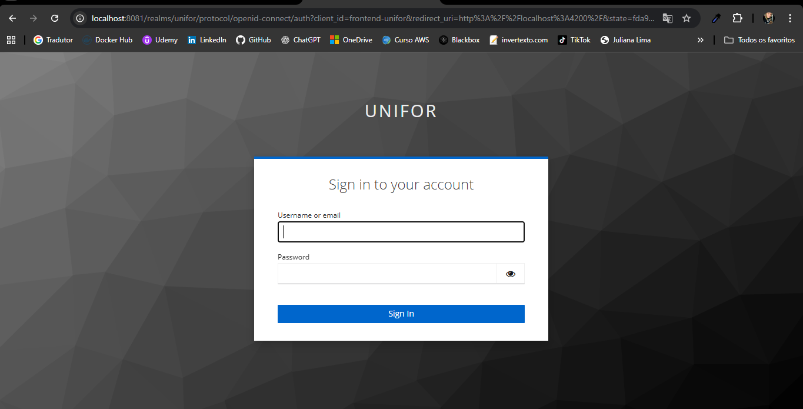
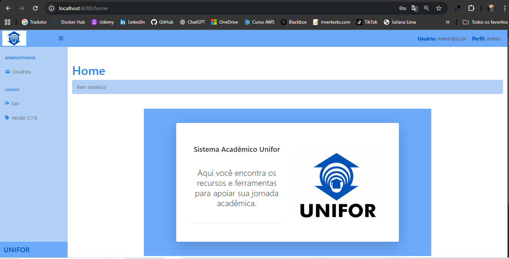
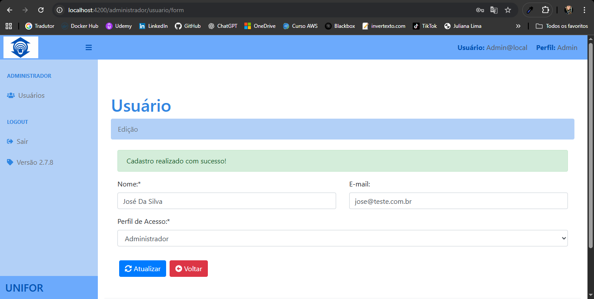
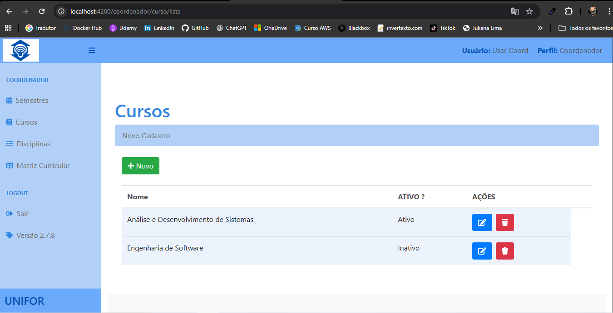

## 🧩 Aplicação Frontend (Angular)

O frontend foi desenvolvido em Angular 15, seguindo o modelo standalone conforme o desafio.
A aplicação foi organizada para refletir os diferentes perfis de acesso:

```
👩‍💼 Administrador – gerencia usuários.

🎓 Coordenador – administra semestres, cursos, disciplinas e monta a matriz curricular.

👨‍🏫 Professor e 👩‍🎓 Aluno – possuem acesso de visualização da matriz curricular.
```

A interface é responsiva e se integra à API Quarkus (Java),
com controle de autenticação e autorização via Keycloak.

### 🧱 Ferramentas

Node.js: versão 18.13.0 (ou superior)

Angular CLI: versão 15.x

Docker

### ⚙️ Execução do projeto
🐳 Subir a aplicação completa (API + Frontend + Keycloak)

Na raiz do projeto, execute:

docker-compose down -v
docker-compose up --build

Isso fará o build e inicializará todos os containers necessários
(backend, frontend e Keycloak).

Após a inicialização, acesse:

Frontend: http://localhost:4200
Keycloak Admin Console: http://localhost:8081

### 🚀 Execução local (sem Docker)

Caso queira rodar o frontend separadamente:

```bash
## Instalação de Dependências
npm install

## Iniciar o Servidor 
ng serve
```

O aplicativo ficará disponível em http://localhost:4200


### 🔐 Credenciais de Login

Durante os testes, utilize um dos usuários pré-configurados no Keycloak.

| 🧩 **Perfil**           | 👤 **Usuário (username)** | 🔑 **Senha** |
| ----------------------- | ------------------------- | ------------ |
| 🧑‍💼 **Administrador** | `admin1`                  | `admin`     |
| 🎓 **Coordenador**      | `User Coord`                  | `admin`     |
| 👨‍🏫 **Professor**     | `User Prof`                   | `admin`      |
| 👩‍🎓 **Aluno**         | `User Aluno`                  | `admin`     |


💡 Observação aos avaliadores:
Após subir os containers via docker-compose up --build, aguarde o Keycloak inicializar completamente antes de tentar o login.
As credenciais acima permitem testar cada papel de acesso no sistema.

### 🧱 Organização e Padrão do Projeto

A estrutura da aplicação foi pensada para garantir clareza, reuso e fácil manutenção, seguindo princípios como DRY (Don’t Repeat Yourself) e SOLID.

🔹 Estrutura modular

O projeto foi dividido em módulos conforme os perfis de acesso (Administrador, Coordenador, etc.), e cada funcionalidade CRUD segue o padrão:


```bash
/pages/
 ├── administrador/
 │    ├── usuario-form/
 │    └── usuario-lista/
 ├── coordenador/
 │    ├── curso/
 │    ├── disciplina/
 │    ├── matriz/
 │    └── semestre/
ng serve
```

Cada entidade possui dois componentes principais:

Form (*-form) → responsável por criação e edição dos registros.

Lista (*-lista) → responsável por exibição, exclusão e listagem.

Essa separação favorece a organização, legibilidade e reutilização de componentes em contextos diferentes.

🔹 Camada de serviços

Para evitar duplicação de código e centralizar a lógica de acesso à API, foi criado um serviço base genérico (BaseCrudService), que abstrai as operações CRUD comuns a todas as entidades.

A partir dele, cada serviço específico (como UsuarioService, CursoService, SemestreService, etc.) apenas estende o serviço base, definindo o tipo e o endpoint da API correspondente.

➡️ Benefícios desse padrão:

Código mais limpo e reutilizável;

Facilita a criação de novos módulos CRUD;

Reduz a repetição de lógica entre serviços;

Mantém o projeto aberto para extensão, mas fechado para modificação (Princípio OCP do SOLID).

🔹 Decisão arquitetural

Optou-se por aplicar a abstração apenas na camada de serviços, mantendo os componentes (form e lista) separados.
Essa decisão foi intencional, já que o projeto tem foco didático e de avaliação — permitindo demonstrar duas abordagens complementares:

a aplicação de padrões genéricos e reutilizáveis nos serviços;

e a clareza estrutural do padrão CRUD tradicional no Angular.

🔹 Outras boas práticas adotadas

Organização por domínio funcional: cada pasta representa um contexto da aplicação (ex: administrador, coordenador, etc.);

Integração com Quarkus via API RESTful, garantindo comunicação eficiente entre frontend e backend;

Autenticação e autorização com Keycloak, utilizando OpenID Connect para controle de acesso baseado em papéis;

Ambiente Docker configurado para Keycloak, PostgreSQL, API e Frontend, permitindo subir toda a stack com um único comando (docker-compose up --build);

Frontend com suporte a CORS, permitindo integração com a API Quarkus mesmo quando executado fora do Docker;

Interfaces separadas por perfil de usuário (Administrador, Coordenador, Professor e Aluno), refletindo os diferentes níveis de acesso e funcionalidades do sistema.

### 🧭 Interface e Perfis
🔐 Login


🏠 Tela Inicial (Home)


👩‍💼 Perfil Administrador


🎓 Perfil Coordenador


👨‍🏫 Perfil Professor e 👩‍🎓 Aluno
